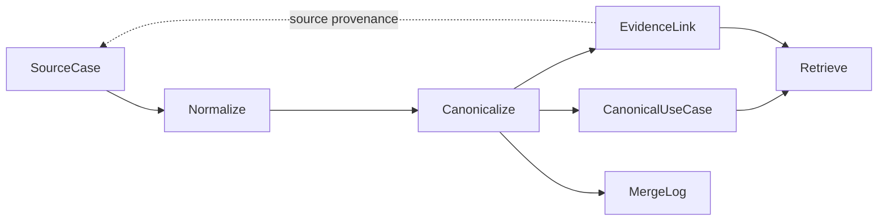

[English](README.md) | **한국어**

> 기본 문서는 영문 README입니다. 기존 한국어 설명을 보존했으며, 이전 환경의 실행 기록과 수치는 현재 검증 결과가 아닙니다. 최신 구현 범위와 검증 한계는 [English README](README.md)를 확인하세요.

# Semantic Marketing KB

**마케팅 활용 사례를 대표 개념으로 통합하고 원문 근거와 연결하는, 벤더 중립적이고 온톨로지 원칙을 참고한 지식 계층입니다.**

**문제.** 벤더별 활용 사례 라이브러리와 고객 사례는 서로 다른 용어를 사용하고, 제품명과 채널, 목표, 구현 방식을 섞어 설명합니다. 표현이 비슷하다는 이유만으로 두 문서가 같은 마케팅 패턴을 다룬다고 판단할 수는 없습니다.

**해결 방식.** 출처별 레코드를 구조화된 의미 속성과 근거 링크를 가진 대표 활용 사례로 정리합니다. 검색 전에 동일 개념인지 판별하므로, 특정 출처의 주장을 패턴 전체의 일반적인 특성으로 취급하지 않고 해당 근거에 연결해 유지합니다.

지식 모델링, 동일 개념 판별(entity resolution), 검색 구조를 보여 주는 소규모 오프라인 참조 구현입니다. **합성 소스 26개를 대표 패턴 12개로 통합**하며, 그중 **8개 패턴에는 가상의 두 벤더에서 나온 근거가 연결**됩니다. 파이프라인에는 정보 추출이나 답변 생성을 위한 LLM이 없습니다.



## 온톨로지 원칙을 참고한 설계

이 프로젝트는 정형 OWL/RDF 온톨로지를 구현한 것이 아닙니다. 명시적인 엔터티 경계로 출처 근거(`SourceCase`)와 대표 도메인 개념(`CanonicalUseCase`)을 분리하고, taxonomy를 통제 어휘로 사용하며, 관계 유형을 갖춘 근거 링크(`EvidenceLink`)로 연결합니다. Canonicalization은 같은 패턴, 변형, 서로 다른 개념을 구분해 개념의 동일성을 판별하고, 병합 로그는 출처와 되돌릴 수 있는 결정 이력을 보존합니다. 이러한 모델링 원칙은 형식 논리 추론이 아니라 대표 개념 통합, 동일 개념 판별, 설명 가능한 검색, 출처를 추적할 수 있는 지식 구성에 실용적으로 적용됩니다.

## 핵심 설계 결정

| 설계 결정 | 실제 구현 |
| --- | --- |
| 임베딩은 후보 생성에 사용 | 해싱 벡터로 가까운 소스 쌍을 제안합니다. 코사인 유사도를 병합 임계값으로 사용하지 않습니다. |
| 결정적 규칙과 구조적 신호로 동일성 판별 | 문서 식별자가 일치하면 중복을 처리합니다. 패턴 병합은 목표, 트리거, 대상 고객, 작동 방식으로 판단합니다. |
| 근거와 대표 개념 분리 | 출처별 이름, 날짜, 성과 수치는 근거에 남깁니다. 대표 개념의 설명은 재사용 가능한 패턴을 다룹니다. |
| 잘못된 병합을 놓친 병합보다 무겁게 평가 | 보수적인 규칙으로 변형을 분리하고, 평가 시 잘못된 병합에 잘못된 분리의 3배 가중치를 줍니다. 학습된 비용이 아닌 명시적인 정책입니다. |
| 되돌릴 수 있는 결정 | 병합 근거를 보존합니다. Python의 `split()`은 이전 로그를 고치지 않고 레코드를 다시 만들고 근거를 재배정합니다. |
| Taxonomy 문맥에 따른 완만한 재정렬 | 검색 후보에 제한된 가산점을 부여합니다. 다른 채널의 패턴도 후보에서 배제하지 않습니다. |

## 합성 데이터 데모 실행

Python 3.10 이상이 필요하며, 로컬 저장소에서 실행합니다. 설치 시 패키지를 다운로드하지만, 이후 기본 데모는 인증 정보나 모델 다운로드 없이 오프라인으로 실행됩니다.

```bash
python3 -m venv .venv
source .venv/bin/activate
python -m pip install -e .
python -m pip install -e '.[dev]'
smkb demo
```

개별 명령:

```bash
smkb build
smkb search "recover abandoned carts" --industry retail --channels email --objective "cart recovery" --k 3
smkb search "birthday offer" --channels in-app --k 3
smkb search "back in stock alert" --channels push --k 3
smkb explain uc:abandoned-basket-recovery
python -m pytest -q
python -m pyflakes src tests
```

`smkb build`는 정규화, 대표 개념 통합, 예제 쌍 평가를 함께 실행합니다. `canonicalize`나 `evaluate`라는 별도 하위 명령은 없습니다. `smkb demo`는 `examples/queries.jsonl`의 질의 3개도 실행합니다. 검색에 `--json`을 붙이면 점수와 문맥 가산점, 근거를 확인할 수 있습니다.

결과는 Git 추적에서 제외된 `build/`에 저장됩니다. 정규화된 소스, 대표 레코드, 근거 링크, 병합 로그, 검토 제안, `build_summary.json`이 생성됩니다. 빌드마다 새 스냅샷을 만들며 **해당 디렉터리의 결과를 덮어씁니다**. 이전 실행을 보존하려면 `--out build/run-2`처럼 다른 경로를 지정하세요. 로그는 하나의 결과 안에서 추가만 되는 구조이며, 여러 빌드에 걸친 영속 이벤트 저장소는 아닙니다.

## 대표 예제 3개

아래의 벤더, 고객, URL, 날짜, 성과 수치는 모두 합성 데이터입니다. `RetailCo`와 `TravelCo`는 가상의 이름이며, 성과 수치는 실제 고객의 측정 결과가 아닙니다.

| 패턴 | 서로 다른 출처의 표현 | 실행 결과 |
| --- | --- | --- |
| 장바구니 이탈 복구 | “Abandoned Basket Recovery”, “RetailCo brings shoppers back to their carts”, “Cart Reminder Journey” | 중복 게시물 하나를 포함한 소스 4개가 `uc:abandoned-basket-recovery`에 연결됩니다. 할인 유도, 탐색 후속 메시지, 예약 알림은 별도로 유지됩니다. |
| 생일 혜택 | “Birthday Offer”, “RetailCo celebrates member birthdays”, “Birthday Message” | 채널과 혜택 기간이 달라도 두 벤더의 소스 3개가 병합됩니다. |
| 재입고 알림 | “Back-in-stock Alert”, “RetailCo tells shoppers when favourites are back” | 두 벤더의 소스 2개가 병합됩니다. 가격 인하 알림은 구조적 속성이 같아도 작동 방식이 달라 변형으로 유지됩니다. |

`smkb demo`의 실제 출력 첫 줄:

```text
built: 26 sources → 12 canonical (8 multi-source, 8 cross-vendor), 14 merges, recommendations {'variant': 21, 'review_required': 4}, evaluation {'pairs': 20, 'precision': 1.0, 'recall': 1.0, 'false_merges': 0, 'false_splits': 0, 'weighted_error': 0.0}
```

병합 **로그 항목은 14개**입니다. 동일한 중복 쌍에 적용된 두 식별 규칙도 각각 기록됩니다. 캠페인 소스 25개가 12개 그룹을 이루며, 운영 문서 하나는 제외됩니다.

실제 순위를 그대로 유지한 검색 출력 일부:

```text
# recover abandoned carts, retail + email + cart recovery
[exact] Abandoned Cart Discount Voucher  score=1.22 sim=0.2343 (uc:abandoned-cart-discount-voucher)
[exact] Abandoned Basket Recovery  score=1.1888 sim=0.227 (uc:abandoned-basket-recovery)

# birthday offer, in-app
[exact] Birthday Offer  score=1.1 sim=0.677 (uc:birthday-offer)
[adjacent] Win-back Campaign  score=0.1568 sim=0.0723 (uc:win-back-campaign)
[other] Abandoned Cart Discount Voucher  score=0.1094 sim=0.0741 (uc:abandoned-cart-discount-voucher)

# back in stock alert, push
[exact] Back-in-stock Alert  score=1.1 sim=0.4903 (uc:back-in-stock-alert)
```

장바구니 질의에서는 할인 변형이 일반 알림보다 앞섭니다. 생일 질의에서는 푸시 기반 재활성화 패턴이 인접 채널 가산점을 받고, 이메일 전용 바우처도 결과에 남습니다. 관련성이 낮거나 질의와 거리가 있는 하위 결과도 숨기지 않았습니다.

`smkb search "birthday offer" --k 3`과 비교하면 생일 혜택은 `1.0`, 바우처는 `0.1094`, 재활성화 캠페인은 `0.1068`입니다. `--channels in-app`을 추가하면 뒤의 두 결과가 순서를 바꿉니다. `exact`와 `adjacent`는 **채널 적합성**을 나타내며, 질의 관련성이나 개념 동일성을 뜻하지 않습니다.

## 합성 데이터 평가

현재 수동으로 정의한 벤치마크는 **라벨이 있는 20쌍: 같은 패턴 13쌍, 변형 4쌍, 서로 다른 개념 3쌍**입니다. 각 라벨에는 판단 이유가 있습니다. 평가는 최종 근거 링크가 두 소스를 같은 대표 레코드에 배정했는지 확인하며, 변형 분류나 검색 순위의 정확도는 측정하지 않습니다.

| 지표 | 현재 해싱 기준선 |
| --- | ---: |
| 잘못된 병합 | 0 |
| 잘못된 분리 | 0 |
| 쌍 단위 정밀도 | 1.0 |
| 같은 패턴 재현율 | 1.0 |
| 가중 오류 (`3 × false merges + false splits`) | 0.0 |

이 결과는 소규모 수작업 합성 벤치마크에 대한 확인이며, 별도의 평가 데이터로 측정한 일반화 성능이 아닙니다. 라벨은 공개 준비 과정에서 명시적으로 다시 작성했고, 결과도 이전 빌드에서 복사하지 않고 재실행했습니다. 공통 작동 방식 키와 정리된 taxonomy 별칭 덕분에 비정형 원문보다 쉬운 데이터입니다. 질의 3개에 대한 검사는 예상 패턴군이 상위 3개에 포함되는지만 확인하므로 검색 품질 벤치마크는 아닙니다.

## 한계

- 512차원 해싱 임베더는 영문 단어와 문자 특징을 사용합니다. 이 예제의 개념 통합 실험에는 충분하지만, **실서비스 수준의 밀집 벡터 검색 품질을 입증하지는 않습니다**. 동의어, 다국어 입력, 잡음이 많은 텍스트에 취약합니다.
- 선택 사항인 sentence-transformers 백엔드는 이번 검토에서 검증하지 않았습니다. 현재는 질의에도 문서용 접두사를 사용하므로, 모델별 검색 연동과 평가가 추가로 필요합니다.
- 규칙과 작동 방식 키는 미리 정리된 입력입니다. 정보 추출, 폭넓은 분류 체계, 클러스터 간 일관성까지 해결하지는 않습니다. Union-find는 모든 구성원 쌍을 검사하지 않고 전이적 병합을 만들 수 있습니다.
- 이름과 수치의 중립화는 결정적 검사이며, 일반적인 개인정보나 사실성 탐지기가 아닙니다. 수동 검토가 필요한 소스가 있을 수 있습니다.
- 후보 수 제한과 패턴군별 개수 제한으로 일부 레코드가 제외될 수 있습니다. 문맥을 완만하게 반영한다는 것은 문맥만으로 후보를 제거하지 않는다는 뜻이며, 모든 결과를 반환한다는 보장은 아닙니다.
- JSONL 스냅샷과 메모리 내 탐색은 현재 데이터 규모에 맞춘 선택입니다. 증분 수집, 영속적인 이벤트 재생, 동시 쓰기, 그래프 데이터베이스는 지원하지 않습니다.
- 지원하는 설치 방식은 이 저장소에서의 editable 설치입니다. 최상위 taxonomy와 예제 파일을 포함하는 독립 wheel 배포는 구성하지 않았습니다.

## 저장소 안내

- [`docs/architecture.md`](docs/architecture.md): 레코드, 분류 체계, 판정 규칙, 검색 점수, 분리 예제
- [`examples/README.md`](examples/README.md): 합성 데이터의 출처, 라벨, 복원 범위
- [`taxonomy/axes.yaml`](taxonomy/axes.yaml): 데모에서 사용하는 10개 축과 52개 값
- [`CLEANROOM_AUDIT.md`](CLEANROOM_AUDIT.md): 공개 콘텐츠 검사와 검토 범위
- [`PORTFOLIO_RELEASE_REVIEW.md`](PORTFOLIO_RELEASE_REVIEW.md): 공개 준비 검증과 소유자 검토 항목

## 라이선스

Copyright (c) 2026 Yongjun Jeong. 별도 표기가 없는 한 코드, 문서, 합성 예제 데이터에는 동일한 [`MIT License`](LICENSE)가 적용되며, 소유자가 이를 확인했습니다. 의존성에는 각자의 라이선스가 적용됩니다.
