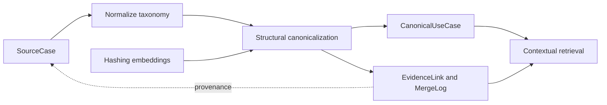

# Semantic Marketing KB

**English** | [한국어](README.ko.md)

An offline reference implementation for reconciling marketing use cases and
retrieving canonical concepts with inspectable source evidence.

## Problem and solution

Different libraries describe the same campaign with different names, or use similar
names for distinct mechanisms. Merging on text similarity alone can turn a
source-specific claim into an unsupported general statement.

This project separates source records from canonical use cases, normalizes a
controlled vocabulary, proposes nearby records with embeddings and applies
structural rules to decide identity. Retrieval attaches evidence back to its
source instead of presenting customer outcomes as universal properties.

The default example uses **26 synthetic sources, 12 canonical patterns and 25
evidence links**. Eight patterns have evidence from two fictional vendors.
There is no LLM extraction, answer generation, RDF/OWL reasoner or graph database.

## Architecture



See [`docs/architecture.md`](docs/architecture.md) for the record model and scoring
rules. An English architecture guide is available alongside the preserved Korean reference.

## Engineering decisions

| Decision | Trade-off |
|---|---|
| Embeddings propose neighbors, not merge decisions | Structural objective, trigger, audience and mechanism rules are inspectable, but depend on already structured input |
| Default 512-dimensional hashing vectors | Runs without model downloads or credentials; English token/character features do not establish multilingual semantic retrieval quality |
| Separate concepts and evidence | Source dates, customer names and outcome values remain attached to source evidence |
| Conservative merge evaluation | False merges receive three times the weight of false splits; this is an explicit policy rather than a learned loss |
| Reversible split API | `split()` rebuilds records and reassigns evidence without changing old log entries |
| Soft context reranking | Taxonomy boosts and a family cap encourage relevant, diverse results; candidates can still be excluded by the finite candidate pool |
| JSONL snapshots and in-memory index | Simple for the reference dataset; no incremental storage, concurrent writes or persistent event replay |

Union-find can create transitive groups without checking every member pair.
Candidate generation materializes a quadratic similarity matrix. These are known
limits of the small reference implementation.

## Run the synthetic example

Python 3.10+ is required. Supported installation is editable from this repository:

```sh
git clone https://github.com/YongjunJeong/semantic-marketing-kb.git
cd semantic-marketing-kb
python3 -m venv .venv
source .venv/bin/activate
python -m pip install -e '.[dev]'
smkb demo
smkb search "recover abandoned carts" --industry retail --channels email --objective "cart recovery" --k 3
smkb search "birthday offer" --channels in-app --k 3
smkb explain uc:abandoned-basket-recovery
python -m pytest -q
python -m pyflakes src tests
```

Installation downloads packages. The default demo then runs offline without model
weights or API keys. `smkb build` performs normalization, canonicalization and
pair evaluation; there are no separate `canonicalize` or `evaluate` CLI commands.

Build results go to ignored `build/` and are overwritten on another build. Use
`smkb demo --out build/run-2` to preserve a separate snapshot. Logs are append-only
within that result, not an event store across independent builds.

## Validation

In the current 2026-10-09 refinement, **20 tests passed** using the existing Python 3.11 environment. They cover
reference construction, provenance, canonicalization, taxonomy, splitting and
retrieval behavior. An offline CI workflow is included; its remote execution must
be checked after publication.

The hand-authored synthetic benchmark contains **20 labelled pairs**: 13 identical
patterns, four variants and three distinct concepts. The default build reports
zero false merges/splits and pair precision/recall of 1.0 on this set. These values
check final group assignment, not variant classification or search ranking.
They are not held-out generalization measurements.

Three example queries check whether an expected pattern family appears in the top
three. In the cart-recovery example, a discount variant ranks above the generic
reminder. The README does not treat that result as a retrieval-quality benchmark.
`exact` and `adjacent` describe channel fit, not concept identity or query relevance.

## Limitations and next work

- Mechanism keys and taxonomy attributes are already prepared; extracting them
  from noisy source documents is outside the implementation.
- Name/outcome neutralization is deterministic, not general privacy or factuality
  detection. Real inputs still need review.
- The optional sentence-transformers backend is experimental and was not executed
  in this audit. It currently applies a passage prefix to both queries and documents.
- The top-level taxonomy/examples are not configured for a self-contained wheel.
- There is no persistent service, managed vector database, cloud deployment or
  answer generation pipeline.

Next, define held-out retrieval labels with hard negatives and noisy multilingual
queries. Measure ranking independently from merge quality. Correct query/document
encoding roles before evaluating the optional dense model; preserve the current
hashing baseline for comparison. Validate knowledge-model constraints and explore
small ontology representations using only independent public or synthetic records.

## Data and license

All bundled vendors, customers, URLs, dates and performance outcomes in the example
records are synthetic. Read [`examples/README.md`](examples/README.md),
[`CLEANROOM_AUDIT.md`](CLEANROOM_AUDIT.md) and
[`PORTFOLIO_RELEASE_REVIEW.md`](PORTFOLIO_RELEASE_REVIEW.md) for their scope.

[MIT](LICENSE), copyright 2026 Yongjun Jeong. The repository's release review records
owner confirmation for code, documents and synthetic fixtures; dependencies retain
their own licenses.
