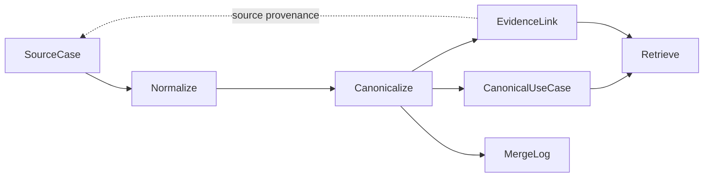

# Semantic Marketing KB

**A vendor-neutral, ontology-inspired knowledge layer for canonicalizing marketing use cases and linking them to source evidence.**

**Problem.** Vendor-specific use case libraries and customer stories use inconsistent terminology and mix product names, channels, goals, and implementations. Similar wording does not establish that two records describe the same marketing pattern.

**Solution.** Normalize source-specific records into canonical use cases with structured semantic attributes and evidence links. Resolve identity before retrieval so that source-specific claims stay attached to their evidence instead of becoming universal claims about a pattern.

This is a small, offline reference implementation of knowledge modeling, entity resolution, and retrieval. It includes **26 synthetic sources → 12 canonical patterns**, with **8 patterns supported across two fictional vendors**. There is no answer-generation or extraction LLM in the pipeline.



## Ontology-inspired design

This knowledge engineering reference implementation is not a formal OWL/RDF ontology. It uses explicit entity boundaries to separate source evidence (`SourceCase`) from canonical domain concepts (`CanonicalUseCase`), a taxonomy as a controlled vocabulary, and typed evidence relationships (`EvidenceLink`). Canonicalization resolves concept identity by distinguishing the same pattern, variants, and different concepts; the merge log preserves provenance and reversible decision history. These modeling principles support practical canonicalization, entity resolution, explainable retrieval, and provenance-aware knowledge organization rather than formal logical inference.

## Core design decisions

| Decision | What the implementation does |
| --- | --- |
| Embeddings generate candidates, not identity | Hashing vectors propose k-nearest source pairs; cosine is not a merge threshold. |
| Deterministic and structural identity | Exact document identifiers handle duplicates. Objective, trigger, audience, and mechanism signals decide pattern merges. |
| Evidence / canonical separation | Source-specific names, dates, and outcome figures remain in evidence. Canonical text describes the reusable pattern. |
| False merges cost more than false splits | Conservative pair rules preserve variants; evaluation weights a false merge 3× a false split. This is an explicit policy, not a learned cost. |
| Reversible decisions | Merge provenance is retained; Python `split()` rebuilds records and reassigns evidence without editing earlier log entries. |
| Taxonomy-aware soft reranking | Context adds bounded score boosts after candidate retrieval. Other channels remain eligible. |

## Run the synthetic demo

Python 3.10+; run from a local checkout. Installation needs package downloads; the default demo then runs offline without credentials or model downloads.

```bash
python3 -m venv .venv
source .venv/bin/activate
python -m pip install -e .
python -m pip install -e '.[dev]'
smkb demo
```

Individual commands:

```bash
smkb build
smkb search "recover abandoned carts" --industry retail --channels email --objective "cart recovery" --k 3
smkb search "birthday offer" --channels in-app --k 3
smkb search "back in stock alert" --channels push --k 3
smkb explain uc:abandoned-basket-recovery
python -m pytest -q
python -m pyflakes src tests
```

`smkb build` runs normalization, canonicalization, and the bundled pair evaluation. There are no separate `canonicalize` or `evaluate` subcommands. `smkb demo` also runs the three queries in `examples/queries.jsonl`. Use `--json` on search to inspect scores, context boosts, and evidence.

Build output goes to ignored `build/`: normalized sources, canonical records, evidence links, merge log, recommendations, and `build_summary.json`. Each build is a fresh snapshot and **overwrites that directory's output**; use `--out build/run-2` to retain a previous run. The log is append-only within a result, not a persistent event store across builds.

## Three examples

All vendors, customers, URLs, dates, and outcome figures below are synthetic. `RetailCo` and `TravelCo` are fictional labels; no reported outcome is a measured customer result.

| Pattern | Heterogeneous source expressions | Observed result |
| --- | --- | --- |
| Cart Abandonment Recovery | “Abandoned Basket Recovery”, “RetailCo brings shoppers back to their carts”, “Cart Reminder Journey” | 4 source records, including one duplicate publication, link to `uc:abandoned-basket-recovery`. Discount incentives, browse follow-ups, and booking reminders remain separate. |
| Birthday Offer | “Birthday Offer”, “RetailCo celebrates member birthdays”, “Birthday Message” | 3 sources across 2 vendors merge despite different channels and offer durations. |
| Back-in-stock Alert | “Back-in-stock Alert”, “RetailCo tells shoppers when favourites are back” | 2 sources across 2 vendors merge. Price-drop Alert remains a variant, even with identical structural axes, because the mechanism differs. |

Actual output from `smkb demo` (first line):

```text
built: 26 sources → 12 canonical (8 multi-source, 8 cross-vendor), 14 merges, recommendations {'variant': 21, 'review_required': 4}, evaluation {'pairs': 20, 'precision': 1.0, 'recall': 1.0, 'false_merges': 0, 'false_splits': 0, 'weighted_error': 0.0}
```

There are 14 merge **log entries**, including two identity rules for the same duplicate pair; 25 campaign sources form 12 groups. One operational document is excluded.

Selected search output, retaining its real ranking:

```text
# recover abandoned carts, retail + email + cart recovery
[exact] Abandoned Cart Discount Voucher  score=1.22 sim=0.2343 (uc:abandoned-cart-discount-voucher)
[exact] Abandoned Basket Recovery  score=1.1888 sim=0.227 (uc:abandoned-basket-recovery)

# birthday offer, in-app
[exact] Birthday Offer  score=1.1 sim=0.677 (uc:birthday-offer)
[adjacent] Win-back Campaign  score=0.1568 sim=0.0723 (uc:win-back-campaign)
[other] Abandoned Cart Discount Voucher  score=0.1094 sim=0.0741 (uc:abandoned-cart-discount-voucher)

# back in stock alert, push
[exact] Back-in-stock Alert  score=1.1 sim=0.4903 (uc:back-in-stock-alert)
```

The cart query ranks the discount variant above the general reminder. The birthday query shows soft context directly: the push-based win-back pattern receives an adjacent-channel boost, while the email-only voucher remains in the results. Neither weak relevance nor unrelated lower-ranked hits are hidden.

Compare with `smkb search "birthday offer" --k 3`: Birthday Offer scores `1.0`, the voucher `0.1094`, and Win-back Campaign `0.1068`. With `--channels in-app`, the last two change order. `exact` and `adjacent` describe **channel compatibility**, not relevance or identity.

## Synthetic evaluation

The current, manually specified benchmark has **20 labelled pairs: 13 same-pattern, 4 variant, 3 different**. Labels include written rationales. Evaluation checks whether the final evidence links place each pair in the same canonical record; it does not score variant classification or search ranking.

| Metric | Current hashing baseline |
| --- | ---: |
| False merges | 0 |
| False splits | 0 |
| Pair precision | 1.0 |
| Same-pattern recall | 1.0 |
| Weighted error (`3 × false merges + false splits`) | 0.0 |

These are checks on a small, hand-authored synthetic benchmark, not a held-out generalization estimate. The labels were explicitly rewritten during release preparation; the current result was rerun, not copied from a previous build. Shared mechanism keys and curated taxonomy aliases make this dataset easier than unstructured source material. Three query checks assert expected family presence in the top three; that is not a retrieval-quality benchmark.

## Limitations

- The 512-dimensional hashing embedder uses English word and character features. It is sufficient to exercise these canonicalization experiments, **not evidence of production-grade dense retrieval quality**. Synonyms, multilingual input, and noisy text are weak points.
- An optional sentence-transformers backend exists but was not validated in this review. Its current shared passage prefix also applies to queries; model-specific retrieval integration and evaluation remain necessary.
- Rules and mechanism keys are curated inputs. Extraction, broad taxonomy coverage, and cross-cluster consistency are not solved here. Union-find can create transitive merges without testing every member pair.
- Neutralization is a deterministic name/number check, not a general privacy or factuality detector. A source can still need manual review.
- Candidate truncation and the family cap can omit records. “Soft context” means no context hard filter; it does not promise exhaustive results.
- JSONL snapshots and in-memory scans suit this corpus. There is no incremental ingestion, durable event replay, concurrent writer support, or graph database.
- The supported setup is an editable installation from this repository. Standalone wheel distribution of the root-level taxonomy and examples is not configured.

## Repository guide

- [`docs/architecture.md`](docs/architecture.md): records, taxonomy, decisions, retrieval scoring, and split example.
- [`examples/README.md`](examples/README.md): synthetic data provenance, labels, and reconstruction scope.
- [`taxonomy/axes.yaml`](taxonomy/axes.yaml): 10 axes and 52 values used by this demo.
- [`CLEANROOM_AUDIT.md`](CLEANROOM_AUDIT.md): public-content audit and its boundaries.
- [`PORTFOLIO_RELEASE_REVIEW.md`](PORTFOLIO_RELEASE_REVIEW.md): release checks and owner review items.

## License

Copyright (c) 2026 Yongjun Jeong. The owner has confirmed that the code, documentation, and synthetic fixtures are covered by the same [`MIT License`](LICENSE), unless otherwise noted. Dependencies retain their own licenses.
