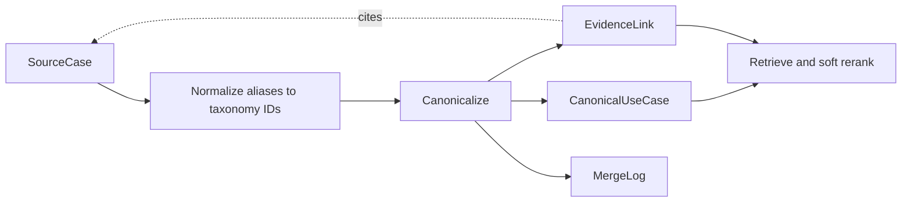

[English](architecture.md) | **한국어**

# 아키텍처

파이프라인은 세 질문을 구분합니다. 원문은 무엇을 말하는가, 어떤 재사용 가능한 패턴을 설명하는가, 어떤 패턴이 질의에 도움이 되는가입니다. 미리 추출된 형태의 합성 레코드로 동작하며, 크롤링과 추출 프롬프트, 답변 생성은 범위 밖입니다.



## 레코드와 경계

| 레코드 | 역할 | 주요 필드 |
| --- | --- | --- |
| `SourceCase` | 가상의 게시자와 고객 이름, 성과를 포함한 출처별 설명 보존 | 호출자가 제공하는 안정적인 `id`, `uri`, `native_id`, 콘텐츠 해시, 소스 유형, 제목, 요약, 작동 방식, 작동 방식 키, 원본 태그, 정규화 속성 |
| `CanonicalUseCase` | 설명에 고유 이름이나 성과 수치를 넣지 않고 재사용 가능한 패턴 표현 | 제목, 요약, 작동 방식, 구성원 분류 속성의 합집합, 대표 목표와 지표, 소스·벤더·사례 수, 상태, 중립화된 별칭, 출처 이력 |
| `EvidenceLink` | 대표 패턴과 소스 연결 | 대표 레코드와 소스 ID, 고객 사례는 `implements`, 그 외는 `describes_pattern`, 연결 방법, 신뢰도, 시각 |
| `MergeLogEntry` | 이전 로그를 대체하지 않고 결정 설명 | `create`, `merge`, `recommend`, `split`, 입력과 출력 ID, 규칙, 선택적 구조 점수와 메모, 시각 |

대표 레코드의 출처 이력에는 소스 ID, 대표 소스, 최종 클러스터 내부의 모든 병합이 기록됩니다. Union-find의 중간 루트가 나중에 바뀐 병합도 포함합니다. 이력의 ID는 의도적으로 소스를 식별하며, 설명 문장은 벤더 중립적으로 유지합니다. 별칭도 중립화하지만 현재 검색에는 사용하지 않습니다. ID 순서상 첫 패턴 라이브러리 레코드를 대표로 우선 선택하고, 없으면 첫 소스를 선택합니다. 생성 모델의 요약이 아닌 결정적 선택입니다.

근거 수는 중복 게시물을 포함한 소스 레코드 수이며, 독립적인 관측의 수가 아닙니다. 링크 신뢰도인 `1.0`과 `0.8`은 각각 병합 연결과 초기 연결에 부여하는 고정 기본값으로, 보정된 확률이 아닙니다. 합성 성과 수치는 근거에만 남으며 대표 패턴의 기대 효과로 취급하지 않습니다.

## 분류 체계와 정규화

[`taxonomy/axes.yaml`](../taxonomy/axes.yaml)은 10개 축과 52개 값을 정의합니다.

| 축 | 구분하는 내용 |
| --- | --- |
| industry | 유통과 여행 등 업종 문맥 |
| journey_stage | 온보딩, 전환, 유지, 재활성화 단계 |
| objective | 복구, 활성화, 충성도, 상품 발견 등의 목표 |
| metric | 목표와 구분되는 측정 지표 |
| segment | 장바구니·탐색·예약 이탈자를 포함한 대상 고객 |
| channel | 전달 채널 |
| format | 메시지, 쿠폰, 배너, 위젯, 오버레이 |
| trigger | 패턴을 시작하는 이벤트나 날짜 |
| capability | 실행을 가능하게 하는 일반적인 기능 |
| complexity | 예시로 제시한 구현 난이도 |

기존 ID 또는 정규화된 라벨과 별칭으로 값을 해석합니다. 예를 들어 `basket recovery`와 `recover cart`는 모두 `obj:recover_conversion`에 대응합니다. 알 수 없는 라벨은 `unmapped`에 남기고 커버리지에 보고합니다. 첫 목표와 지표가 대표값이 됩니다. 시그니처는 확인용으로 저장하며, 동일성 규칙이나 순위 특징으로 사용하지 않습니다.

채널 그룹은 명시적입니다. 푸시와 인앱은 `app`, 이메일과 SMS는 `messaging`, 웹은 `web`입니다. 데모를 위한 선택이며 업계 전체를 포괄하는 온톨로지는 아닙니다. 정규화는 전달받은 소스 객체를 메모리에서 수정합니다.

## 대표 개념 통합 흐름

1. 정규화된 캠페인 레코드만 사용하고 중복 소스 ID는 거부합니다. 운영 레코드는 정규화 결과에는 남지만 대표 개념에 연결하지 않습니다.
2. 문서 동일성 규칙을 적용합니다. 비어 있지 않은 동일 URI(양끝 공백 제거, 대소문자 유지), `(vendor, native_id)`, 콘텐츠 해시를 사용합니다. 구조 검사를 건너뛰므로 신뢰할 수 있는 식별자를 전제합니다. 해시는 제목, 요약, 작동 방식, 태그, 성과를 대상으로 하며 크롤링한 페이지의 해시가 아닙니다.
3. 제목, 요약, 작동 방식을 정규화된 해싱 벡터로 만듭니다. 전체 코사인 탐색으로 소스마다 최대 8개 이웃을 제안하고, 후보 쌍을 중복 제거하며 상호 이웃 여부를 표시합니다.
4. 목표(2), 트리거(2), 대상 고객(1.5), 채널(1), 형식(1), 여정 단계(0.5)의 가중 Jaccard 유사도를 계산합니다. 양쪽 모두 비어 있는 축은 분모에서 제외합니다.
5. 아래의 결정적 분류기를 적용합니다. 구조 점수가 높은 쌍부터 처리하고, 수락한 병합에는 union-find를 사용합니다.
6. 대표 레코드와 근거 링크를 만들고 검토 제안과 출처 이력을 보존합니다.

| 순서대로 적용하는 조건 | 판정과 처리 |
| --- | --- |
| 알려진 이탈 고객군이 서로 겹치지 않음 | 구조 점수 ≥ 0.25이면 `variant`, 아니면 `different`. 병합하지 않음 |
| 첫 목표 일치, 트리거 중첩, 구조 점수 ≥ 0.45이며, 비어 있지 않은 작동 방식 키가 같거나 (제목 Jaccard ≥ 0.5이고 작동 방식 Jaccard ≥ 0.3) | `same_pattern`, 병합 |
| 목표와 트리거가 일치하고 구조 점수 ≥ 0.25 | `variant`, 검토 제안만 기록 |
| 상호 이웃이며 구조 점수 ≥ 0.25 | `review_required`, 검토 제안만 기록 |
| 그 외 | `different`, 후보 제외 |

코사인은 동일성을 결정하지 않습니다. 작동 방식 키가 같아도 구조적 합의가 없으면 병합하지 않습니다. 대상 고객 충돌 목록은 의도적으로 좁고, union-find는 클러스터의 모든 쌍이 양립하는지 검사하지 않습니다. 문서 동일성 규칙은 주석이 충돌하는 레코드도 병합할 수 있습니다. 이는 현재 구현의 한계입니다.

잘못된 병합은 서로 다른 개입에 관한 근거를 섞지만, 잘못된 분리는 검토 가능한 레코드 두 개를 남깁니다. 따라서 평가기는 `3 × false_merges + false_splits`를 보고합니다. 이 가중치는 보고되는 오류에만 영향을 주며 최적화 절차가 아닙니다. 최종 클러스터 소속을 평가하기 전에 라벨의 관계 유형과 참조 소스 ID를 검증합니다.

## 병합 되돌리기

`split()`은 CLI 명령이 아닌 Python API입니다. 자식 레코드의 설명과 속성을 다시 만들기 위해 정규화된 소스가 필요합니다. 모든 소스를 빠짐없이 포함하고 서로 겹치지 않으며 비어 있지 않은 분할인지 검증합니다. 이후 새 결과를 반환하고, 부모 레코드를 비활성화하고, 자식 레코드를 만들고, 근거를 재배정하고, 분리 이벤트를 추가합니다. 원래 결과와 이전 이벤트는 바뀌지 않습니다.

```python
from semantic_marketing_kb.canonicalize import canonicalize, split
from semantic_marketing_kb.cli import EXAMPLES, load_sources
from semantic_marketing_kb.embed import HashingEmbedder
from semantic_marketing_kb.normalize import normalize_all
from semantic_marketing_kb.taxonomy import Taxonomy

sources = normalize_all(load_sources(EXAMPLES / "source_cases.jsonl"), Taxonomy())
result = canonicalize(sources, HashingEmbedder())
cart = next(u for u in result.usecases if u.id == "uc:abandoned-basket-recovery")
ids = cart.provenance["built_from"]
revised = split(result, cart.id, [ids[:2], ids[2:]],
                sources=sources, note="Illustrative manual partition")
assert revised.merge_log[-1].op == "split"
assert all(link.usecase_id != cart.id for link in revised.links)
assert cart.status == "active"  # original snapshot unchanged
```

이 코드는 분할 방법을 보여 주는 예제이며 데모 정답을 수정하는 과정이 아닙니다. 자식의 출처 이력에는 기존 이력과 분리 이벤트 참조가 남습니다. 검토 제안도 과거 관측으로 유지되며 새 검토 대기열로 다시 계산하지 않습니다. 이후 전체 빌드는 수동 분리를 재생하지 않습니다. 수정 결과를 보존하려면 레코드와 로그를 별도 스냅샷으로 명시적으로 저장해야 합니다. CLI는 재빌드 시 파일을 덮어쓰므로 영속적인 추가 전용 저장이나 트랜잭션을 보장하지 않습니다.

## 검색 흐름

1. 선택한 임베더로 활성 대표 레코드의 제목, 요약, 작동 방식만 색인합니다.
2. 질의 코사인 유사도를 계산하고 최대 `4 × top_k`개의 후보를 가져옵니다.
3. Taxonomy 별칭으로 문맥을 해석하고 가산점을 더합니다.
4. 점수순으로 정렬하며, 기본적으로 목표와 트리거로 묶인 패턴군마다 결과를 최대 2개 허용합니다.
5. 근거를 최대 3개 연결합니다. 업종 일치, 고객 사례, 성과가 있는 소스를 우선하며, 벤더 다양성을 먼저 확보한 뒤 나머지 자리를 채웁니다.

```text
score = cosine / scale
      + channel tier boost (exact 0.10, adjacent 0.05, other 0)
      + industry match 0.06
      + objective match 0.06
      + journey-stage match 0.03
scale = highest candidate cosine if positive, otherwise 1.0
```

점수는 질의에 상대적이며 음수이거나 1보다 클 수 있습니다. 확률이 아닙니다. 문맥 가산점의 최대 합은 0.25이고, 알 수 없는 채널 그룹끼리는 인접하다고 판단하지 않습니다. 문맥 자체로 후보를 거부하지는 않지만 후보 수와 패턴군별 개수 제한은 적용됩니다. `--no-family-cap`으로 패턴군 제한 없는 순위를 확인할 수 있습니다.

생일 데모는 인앱 문맥에 따라 하위 결과 두 개의 순서를 바꾸면서 이메일 전용 결과도 반환합니다. 장바구니 데모는 어휘 기반 기준선의 약점도 보여 줍니다. 할인 변형이 일반 알림보다 앞섭니다. 쌍 단위 동일성 판별의 성공이 검색 품질의 근거는 아닙니다.

## 그래프 데이터베이스가 없는 이유

소스 26개와 패턴 12개에서는 JSONL과 ID를 키로 쓰는 딕셔너리만으로 필요한 관계를 표현할 수 있습니다. 근거 조회는 대표 ID에 따른 조인이고, 출처 이력은 참조 목록이며, 여러 단계를 잇는 그래프 질의는 없습니다. NumPy 탐색과 메모리 내 union-find를 사용해 별도 서비스 없이 결정 과정을 확인하고 재현할 수 있습니다.

전체 쌍 후보 행렬의 공간 사용량은 데이터 수의 제곱에 비례하고, 검색은 모든 활성 패턴을 탐색합니다. 데이터가 커지면 근사 벡터 색인이 필요할 수 있습니다. 동시 수정, 영속적인 분리 이력 재생, 트랜잭션을 보장하는 감사 이력이 필요하면 데이터베이스를 고려할 수 있습니다. 그래프 데이터베이스는 연결된 레코드가 있다는 이유보다 실제 관계 탐색 요구가 있을 때 선택해야 합니다.
