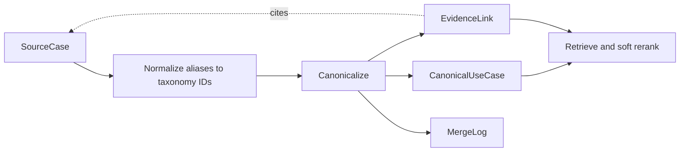

# Architecture

The pipeline answers three separate questions: what a source says, which reusable pattern it describes, and which patterns help a query. It operates on pre-extracted synthetic records; crawling, extraction prompts, and answer generation are outside its scope.



## Records and boundaries

| Record | Responsibility | Important fields |
| --- | --- | --- |
| `SourceCase` | Preserve a source-specific account, including fictional publisher/customer names and outcomes | Caller-supplied stable `id`, `uri`, `native_id`, content hash, source type, title, summary, mechanism, mechanism key, raw tags, normalized attributes |
| `CanonicalUseCase` | Describe a reusable pattern without named parties or outcome figures in its descriptive text | Title, summary, mechanism, union of member axes, representative primary objective/metric, source/vendor/story counts, status, neutralized aliases, provenance |
| `EvidenceLink` | Join a canonical pattern to a source | Canonical/source IDs, `implements` for stories or `describes_pattern` otherwise, method, confidence, timestamp |
| `MergeLogEntry` | Explain decisions without replacing earlier entries in a result | `create`, `merge`, `recommend`, or `split`; input/output IDs, rule, optional structural scores and note, timestamp |

Canonical provenance records source IDs, the representative source, and every merge within the final cluster—including merges whose intermediate union-find root later changed. IDs in provenance deliberately identify sources; descriptive text is vendor-neutral. Aliases are neutralized and are not currently indexed. The first pattern-library record by ID is preferred as representative; otherwise the first source by ID is used. This is deterministic selection, not generated synthesis.

Evidence count counts source records, including duplicate publications; it is not a count of independent corroborating observations. Link confidence values (`1.0` for a merge-derived link, `0.8` for a seed) are fixed bookkeeping defaults, not calibrated probabilities. Synthetic outcomes remain evidence claims, never expected effects of a canonical pattern.

## Taxonomy and normalization

[`taxonomy/axes.yaml`](../taxonomy/axes.yaml) defines 10 axes and 52 values:

| Axis | Separates |
| --- | --- |
| industry | Retail and travel context |
| journey_stage | Onboarding, conversion, retention, win-back |
| objective | Recovery, activation, loyalty, discovery, and other goals |
| metric | What is measured, separate from the goal |
| segment | Audience, including cart / browse / booking abandoners |
| channel | Delivery surface |
| format | Message, coupon, banner, widget, overlay |
| trigger | Event or date that starts the pattern |
| capability | Generic enabling functionality |
| complexity | Illustrative implementation effort |

Resolution uses an existing ID or a normalized label/alias. For example, `basket recovery` and `recover cart` both map to `obj:recover_conversion`. Unknown labels are retained in `unmapped` and reported in coverage. The first objective and metric become the primary values. A signature is stored for inspection; it is not used as an identity rule or ranking feature.

Channel groups are explicit: push and in-app are `app`; email and SMS are `messaging`; web is `web`. These are demo choices, not an exhaustive industry ontology. Normalization edits the supplied source objects in memory.

## Canonicalization flow

1. Keep normalized campaign records; reject duplicate source IDs. Operational records remain in normalized output but have no canonical link.
2. Apply document-identity rules: identical nonempty URI (trimmed, with case preserved), `(vendor, native_id)`, or content hash. These rules bypass structural checks and therefore assume trustworthy identifiers. The hash covers title, summary, mechanism, tags, and outcomes; it is not a hash of a crawled page.
3. Hash title + summary + mechanism into normalized vectors. Exhaustive cosine search proposes up to 8 neighbors per source. Deduplicate candidate pairs and mark mutual neighbors.
4. Compute weighted Jaccard similarity over objective (2), trigger (2), segment (1.5), channel (1), format (1), and journey stage (0.5). Omit axes empty on both sides from the denominator.
5. Apply the following deterministic classifier; process pairs by decreasing structural score, using union-find for accepted merges.
6. Build canonical records, attach evidence, and retain recommendations and provenance.

| Condition, in order | Decision and action |
| --- | --- |
| Disjoint known abandonment audiences | `variant` if structural score ≥ 0.25, otherwise `different`; do not merge |
| Same first objective, overlapping trigger, structural ≥ 0.45, and same nonempty mechanism key **or** title Jaccard ≥ 0.5 plus mechanism Jaccard ≥ 0.3 | `same_pattern`; merge |
| Objective + trigger agree and structural ≥ 0.25 | `variant`; recommend only |
| Mutual neighbors and structural ≥ 0.25 | `review_required`; recommend only |
| Otherwise | `different`; discard the candidate |

Cosine never decides identity. A matching mechanism key also cannot merge without structural agreement. The audience conflict list is deliberately narrow, and union-find does not enforce all-pairs cluster compatibility. Deterministic document rules can also merge records whose annotations conflict. These are current limits, not hidden guarantees.

A false merge mixes evidence about different interventions; a false split leaves two inspectable records. The evaluator therefore reports `3 × false_merges + false_splits`. The weight only affects the reported error; it is not an optimization procedure. It validates label relations and referenced source IDs before scoring final cluster membership.

## Reversing a merge

`split()` is a Python API, not a CLI command. It requires the normalized sources to rebuild child descriptions and axes. It validates a complete, nonempty, disjoint partition, returns a new result, retires the parent, creates children, reassigns evidence, and appends a split event. The original result and earlier events remain unchanged.

```python
from semantic_marketing_kb.canonicalize import canonicalize, split
from semantic_marketing_kb.cli import EXAMPLES, load_sources
from semantic_marketing_kb.embed import HashingEmbedder
from semantic_marketing_kb.normalize import normalize_all
from semantic_marketing_kb.taxonomy import Taxonomy

sources = normalize_all(load_sources(EXAMPLES / "source_cases.jsonl"), Taxonomy())
result = canonicalize(sources, HashingEmbedder())
cart = next(u for u in result.usecases if u.id == "uc:abandoned-basket-recovery")
ids = cart.provenance["built_from"]
revised = split(result, cart.id, [ids[:2], ids[2:]],
                sources=sources, note="Illustrative manual partition")
assert revised.merge_log[-1].op == "split"
assert all(link.usecase_id != cart.id for link in revised.links)
assert cart.status == "active"  # original snapshot unchanged
```

This is an illustrative partition, not a correction to the demo ground truth. Child provenance retains the previous history plus the split reference. Recommendations remain historical observations, not a recomputed review queue. A later full build does not replay manual splits. To persist a revised result, explicitly write its records and log to a separate snapshot. The CLI overwrites files on rebuild; there is no durable append-only storage or transaction guarantee.

## Retrieval flow

1. Index only active canonical title + summary + mechanism, using the selected embedder.
2. Compute query cosine similarities and take up to `4 × top_k` candidates.
3. Resolve context through taxonomy aliases and add soft boosts.
4. Sort by score; allow at most two results per objective/trigger family by default.
5. Attach up to three evidence records, preferring matching industry, stories, and outcome-bearing sources, with vendor diversity before filling remaining slots.

```text
score = cosine / scale
      + channel tier boost (exact 0.10, adjacent 0.05, other 0)
      + industry match 0.06
      + objective match 0.06
      + journey-stage match 0.03
scale = highest candidate cosine if positive, otherwise 1.0
```

The score is query-relative, may be negative or greater than 1, and is not a probability. The maximum context boost is 0.25. Unknown channel groups do not create adjacency. Context never rejects a candidate, but candidate truncation and family diversity do limit output. Use `--no-family-cap` to inspect ranking without that diversity limit.

The birthday demo changes the order of two lower-ranked results under in-app context and still returns an email-only result. The cart demo also exposes the lexical baseline's weakness: the discount variant ranks before the general cart reminder. Pair-resolution success is not retrieval-quality evidence.

## Why no graph database?

At 26 sources and 12 patterns, JSONL plus ID-indexed dictionaries expresses every required relationship. Evidence lookup is a join by canonical ID; provenance is a list of references; there are no multi-hop graph queries. NumPy scans and an in-memory union-find keep the decision path inspectable and reproducible without a service dependency.

The all-pairs candidate matrix takes quadratic space; retrieval scans all active patterns. A larger corpus could justify an approximate vector index. Concurrent updates, persistent split replay, or transactional audit history could justify a database. A graph database would be warranted by actual traversal requirements, not by the presence of linked records alone.
